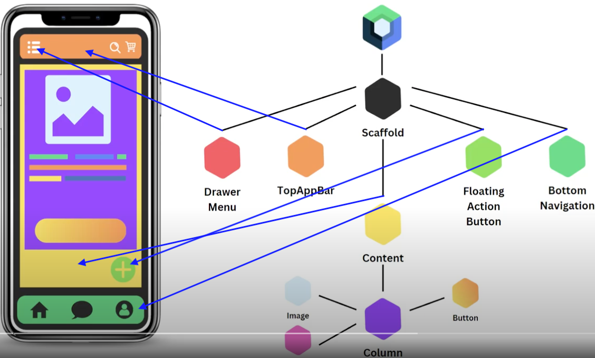

# Material Design: Giúp thiết kế nhanh hơn

## Scaffold: Dàn trang sẵn

```kotlin
fun Scaffold(
    modifier: Modifier = Modifier,
    topBar: @Composable () -> Unit = {},
    bottomBar: @Composable () -> Unit = {},
    snackbarHost: @Composable () -> Unit = {},
    floatingActionButton: @Composable () -> Unit = {},
    floatingActionButtonPosition: FabPosition = FabPosition.End,
    containerColor: Color = MaterialTheme.colorScheme.background,
    contentColor: Color = contentColorFor(containerColor),
    contentWindowInsets: WindowInsets = ScaffoldDefaults.contentWindowInsets,
    content: @Composable (PaddingValues) -> Unit
)
```

