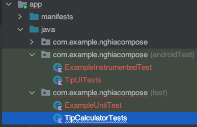

# Test

## Test Function


- file trong thư mục "test"

```kotlin
// Test Hàm calculateTip
class TipCalculatorTests {

    @Test
    fun calculate_20_percent_tip_no_roundup() {
        val amount = 10.00
        val tipPercent = 20.00

        // Giá trị mong trả về
        val expectedTip = NumberFormat.getCurrencyInstance().format(2)

        // ===== Test hàm "calculateTip" =====
        // Giá trị trả về khi test hàm
        val actualTip = calculateTip(amount = amount, tipPercent = tipPercent, false)

        // So sánh 2 kết quả
        assertEquals(expectedTip, actualTip)
        // 1 số hàm kiểm tra
        /*
        assertEquals()
        assertNotEquals()
        assertTrue()
        assertFalse()
        assertNull()
        assertNotNull()
        assertThat()
         */
    }
}
```

## Test Compose UI

- file trong thư mục "androidTest"

```kotlin
// Test TipUI UI
class TipUITests {
    @get:Rule
    val composeTestRule = createComposeRule()

    // Kiểm tra TextView trả về đúng value
    @Test
    fun calculate_20_percent_tip() {

        // Gọi UI, giống trong Main
        composeTestRule.setContent {
            AppTheme {
                // A surface container using the 'background' color from the theme
                Surface(
                    modifier = Modifier.fillMaxSize()
                ) {
                    TipTimeScreen()
                }
            }
        }

        // Tìm EditText("Bill Amount"), nhập vào 10
        composeTestRule.onNodeWithText("Bill Amount")
            .performTextInput("10")

        // Tìm EditText("Tip (%)"), nhập vào 20
        composeTestRule.onNodeWithText("Tip (%)").performTextInput("20")

        // Kết quả mong muốn trả về: $2.00
        val expectedTip = NumberFormat.getCurrencyInstance().format(2)
        Log.e("///", "Tip Amount: $expectedTip")

        // Tìm TextView("Tip Amount: $2.00"). không có thì xuất: "No node"
        composeTestRule.onNodeWithText("Tip Amount: $expectedTip").assertExists(
            "No node with this text was found."
        )
    }
}
```
