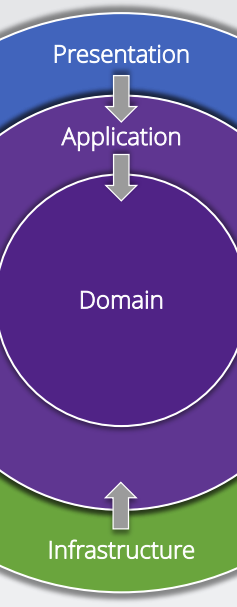

# Clean Architecture

- Independent of frameworks
- Testable
- Independent of UI
- Independent of database
- Independent anything external

- Domain contains enterprise-wide logic and types
- Application contains business-logic and types
- Infrastructure contains all external concerns
- Presentation and Infrastructure depend only on Application
- Infrastructure and Presentation components can be replaced
with minimal effort

## Domain Layer

Entities (Database model)
Value Objects
Enumerations
Logic
Exceptions

## Application Layer (Ứng dụng)

Interfaces
Models
Mapping
Logic
Commands / Queries
Validators
Exceptions

## Infrastructure Layer (Cơ sở hạ tầng)

Persistence
Identity
File System
System Clock
API Clients

## Presentation Layer (Hiển thị)

SPA – Angular, React, Vue
Web API
Razor Pages
MVC
Web Forms