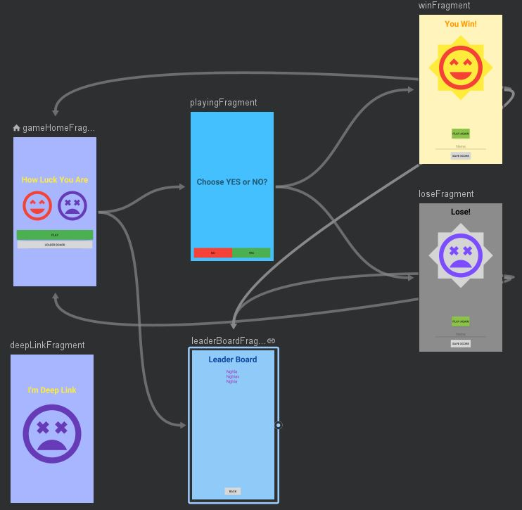

# Android Navigation

- Quản lý điều hướng Fragment trong Activity
- Xử lý nhiều vấn đề:
  - Passing Arguments
  - Fragment Transaction
  - Deep Links
  - Up & Back
  - Animation
  - Errorprone Boilerplate (lỗi bản mẫu)
  - Single Activity App

- [Android Navigation](#android-navigation)
  - [Cài đặt](#cài-đặt)
  - [Thuộc tính](#thuộc-tính)
  - [Sử dụng](#sử-dụng)
    - [Hiển thị Navigation trong Activity](#hiển-thị-navigation-trong-activity)
    - [Điều hướng trong Fragment](#điều-hướng-trong-fragment)
    - [Gởi Argument giữa các Fragment](#gởi-argument-giữa-các-fragment)
    - [Tạo PendingIntent (DeepLink)](#tạo-pendingintent-deeplink)
  - [Thay đổi trong Fragment](#thay-đổi-trong-fragment)
  - [Tham khảo](#tham-khảo)

## Cài đặt

- app.gradle

```json
apply plugin: 'androidx.navigation.safeargs'
//...
dependencies { //...
  def nav_version = "2.1.0"

  // Java
  implementation "androidx.navigation:navigation-fragment:$nav_version"
  implementation "androidx.navigation:navigation-ui:$nav_version"

  // Kotlin
  implementation "androidx.navigation:navigation-fragment-ktx:$nav_version"
  implementation "androidx.navigation:navigation-ui-ktx:$nav_version"

}
```

- build.gradle (Project:...)

```json
buildscript { //...
    dependencies { //...
        classpath "android.arch.navigation:navigation-safe-args-gradle-plugin:1.0.0"
    }
}
```

- Tạo Resouce File: nav_game.xml (Resouce type: Navigation)
- Kéo các Fragment vào

## Thuộc tính



```xml
<!--Navigation Chính, chứa Fragment 
app:startDestination: Fragmen gốc, hiện đầu tiên-->
<navigation
    android:id="@+id/nav_game"
    app:startDestination="@id/gameHomeFragment">
    <fragment
        android:id="@+id/gameHomeFragment"
        android:name="com.example.androidjetpack.architecture.navigation.fragments.GameHomeFragment"
        android:label="fragment_game_home"
        tools:layout="@layout/fragment_game_home" >
        <!--Miêu tả đường đi của Fragment-->
        <action
            android:id="@+id/action_gameHomeFragment_to_leaderBoardFragment"
            app:destination="@id/leaderBoardFragment" />
    </fragment>

    <fragment
        android:id="@+id/leaderBoardFragment">
        <!--nhận Argument gởi đến-->
        <argument
            android:name="newName"
            app:argType="string"
            android:defaultValue="-" />
    </fragment>

    <fragment
        android:id="@+id/winFragment">
        <action
            android:id="@+id/action_winFragment_to_leaderBoardFragment"
            app:destination="@id/leaderBoardFragment" />
        <action
            android:id="@+id/action_playAgain"
            app:popUpTo="@id/gameHomeFragment" />
        <!--app:popUpTo="@id/gameHomeFragment"
        Nhảy đến Fragment trước, bỏ qua tất cả fragment ở giữa
        -->
        app:popUpToInclusive="true" // Thay thế gameHomeFragment cũ bằng mới
        app:popUpToSaveState="true" // Lưu trạng thái điều hướng
    </fragment>
</navigation>

<action ...
    enterAnim: showing distination animation
    popEnterAnim: show current fragment animation when back />
```


## Sử dụng

### Hiển thị Navigation trong Activity

- Tạo trong Fragment XML

```xml
<!--
app:defaultNavHost="true"
android:name="androidx.navigation.fragment.NavHostFragment"
Kết nối hệ thống Back Button của NavHostFragment

app:navGraph="@navigation/nav_game"
Set Navigation Graph for Fragment
-->
<fragment
    android:id="@+id/nav_host_fragment"
    android:name="androidx.navigation.fragment.NavHostFragment"

    app:defaultNavHost="true"
    app:navGraph="@navigation/nav_game"/>
```

- Tạo trong Activity

```xml
<FrameLayout
    android:id="@+id/layoutFragmentContainer" />
```

```java
val host = NavHostFragment.create(R.navigation.nav_game)
supportFragmentManager.beginTransaction().replace(R.id.layoutFragmentContainer, host).setPrimaryNavigationFragment(host).commit()
```

### Điều hướng trong Fragment

```java
//Từ HomeFragment hiện LeaderBoard Fragment
findNavController().navigate(R.id.action_gameHomeFragment_to_leaderBoardFragment, null)
// or
findNavController().navigate(GameHomeFragmentDirections.actionGameHomeFragmentToLeaderBoardFragment())
// Or
findNavController().navigate(R.id.leaderBoardFragment, LeaderBoardFragmentArgs().toBundle())

// Quay về Fragment trước
findNavController().popBackStack()
// or
findNavController().navigateUp()

// Win quay về Home, bỏ qua các fragment ở giữa
findNavController().navigate(R.id.action_playAgain)

// Thêm hiệu ứng
val options = navOptions {
    anim {
        enter = R.anim.fade_slide_out_top
        exit = R.anim.fade_slide_in_top
        popEnter = R.anim.fade_slide_out_top
        popExit = R.anim.fade_slide_in_top
    }
}

findNavController().navigate(R.id.action_playingFragment_to_winFragment, null, options)
```

### Gởi Argument giữa các Fragment

```java
// WinFragment: Send newName
val newName = editTextName.text.toString()

val action = WinFragmentDirections.actionWinFragmentToLeaderBoardFragment()
action.newName = newName
findNavController().navigate(action)

// LeaderBoardFragment: Receive newName
fun onViewCreated() { //...
    arguments?.let {
        val safeArgs = LeaderBoardFragmentArgs.fromBundle(it)
        val newName = safeArgs.newName
        textViewName.text = newName
    }
}
```

### Tạo PendingIntent (DeepLink)

- Để hiển thị Fragment trong Activity khi click notification, Widget

```java
// Gởi
// Goto NavigationTestActivity, tới màn hình deepLinkFragment
val args = Bundle()
args.putString("myarg", "From Widget")
val pendingIntent = NavDeepLinkBuilder(context)
        .setGraph(R.navigation.nav_game)
        .setDestination(R.id.deepLinkFragment)
        .setComponentName(NavigationTestActivity::class.java)
        .setArguments(args)
        .createPendingIntent()

// Nhận ở deepLinkFragment
val myarg = arguments?.getString("myarg")
```

## Thay đổi trong Fragment

```java
class Leaderboard : Fragment() {

    override fun onCreateView(inflater: LayoutInflater, container: ViewGroup?, savedInstanceState: Bundle?): View? {
        
        // Inflate the layout for this fragment
        val view = inflater.inflate(R.layout.fragment_leaderboard, container, false)

        // ======= Find, Init View =======
        val viewAdapter = MyAdapter(Array(10) { "Person ${it + 1}" })
        view.findViewById<RecyclerView>(R.id.leaderboard_list).run {
            adapter = viewAdapter
        }

        // ======== Set Event ========
        view.findViewById<Button>(R.id.about_btn).setOnClickListener {
            findNavController().navigate(R.id.action_title_to_about)
        }

        return view
    }

}
```

---

## Tham khảo

- <https://codelabs.developers.google.com/codelabs/android-navigation/index.html>
