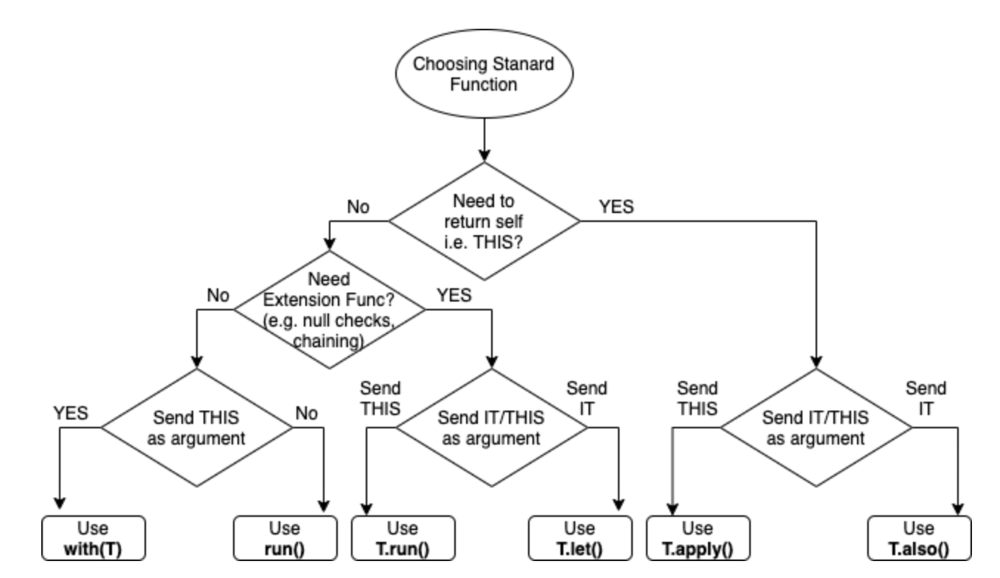

# Kotlin Special

- [Kotlin Special](#kotlin-special)
  - [Enum](#enum)
  - [Extention Extented](#extention-extented)
  - [Scrope funtions](#scrope-funtions)

## Enum

```kotlin
enum class DateTimeFormat constructor(val value: String) {
    DDMMYYYY_HHMM("dd/MM/yyyy HH:mm"),
    WEEK_MONTH_DAY_YEAR("EEEE, dd MMMM, yyyy"),
    DDMMYYYY("dd/MM/yyyy"),
    HHMM("HH:mm")
}

// Using
AppEnum.DateTimeFormat.HHMM.value // output: "HH:mm"
```

## Extention Extented

```kotlin
fun <T : ImageView> T.loadWithCoil(url: String?) {
    //...
}
```

## Scrope funtions



- <https://kotlinlang.org/docs/scope-functions.html#function-selection>

- Use: extensively to automatically manage those resources

```java
val content = "Hello World".repeat(1000)
val file: File = createTempFile()
val inputStream = ByteArrayInputStream(content.toByteArray())

inputStream.use { input ->
    file.outputStream().use { output ->
        input.copyTo(output)
    }
}

assertThat(file).hasContent(content)

fun File.copyInputStreamToFile(inputStream: InputStream) {
    this.outputStream().use { fileOut ->
        inputStream.copyTo(fileOut)
    }
}

fun InputStream.toFile(path: String) {
    File(path).outputStream().use { this.copyTo(it) }
}
```

## Sử dụng interface onBackPressed cho fragment

```java
// === 1 - Create Interface
interface IOnBackPressed {
    fun onBackPressed(): Boolean
}
// === 2 - Prepare your Activity
class MyActivity : AppCompatActivity() {
    override fun onBackPressed() {
        val fragment = this.supportFragmentManager.findFragmentById(R.id.main_container)
        (fragment as? IOnBackPressed)?.onBackPressed()?.not()?.let {
            super.onBackPressed()
        }
    }
}
// === 3 - Implement in your target Fragment
class MyFragment : Fragment(), IOnBackPressed {
    override fun onBackPressed(): Boolean {
        return if (myCondition) {
            //action not popBackStack
            true
        } else {
            false
        }
    }
}
```

- <https://stackoverflow.com/questions/5448653/how-to-implement-onbackpressed-in-fragments>


