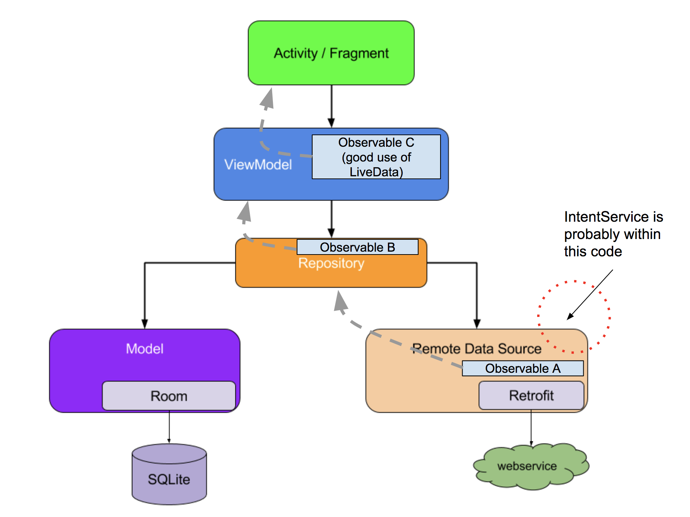

# Live Data + Room + MVVM





## Setup Gradle

project Gradle file

```js
// build.gradle (Project: <your_app>)
allprojects {
    repositories {
        jcenter()
       google()
    }
}
ext {
    roomVersion = '1.1.1'
    archLifecycleVersion = '1.1.1'
}

// build.gradle (app)
dependencies {
    ...
    // Room components
    implementation "android.arch.persistence.room:runtime:$rootProject.roomVersion"
    annotationProcessor "android.arch.persistence.room:compiler:$rootProject.roomVersion"
    androidTestImplementation "android.arch.persistence.room:testing:$rootProject.roomVersion"
    // Lifecycle components
    implementation "android.arch.lifecycle:extensions:$rootProject.archLifecycleVersion"
    annotationProcessor "android.arch.lifecycle:compiler:$rootProject.archLifecycleVersion"
}
```

## Make Room Data

### Note Model

Định nghĩa Table, field data

```java
@Entity(tableName = "note_table")
public class Note {

    @PrimaryKey(autoGenerate = true)
    private int id; // Auto Generate Id

    @NonNull
    @ColumnInfo(name = "text")
    private String text;

    public Note(@NonNull String text) {
        this.text = text;
    }

    //... GETTER, SETTER: id, text
}
```

### Note DAO (Data Access Object)

Định nghĩa SQL, Create, Update, Delete

```java
@Dao
public interface NoteDAO {
    @Insert
    List<Long> insert(Note... notes);

    @Insert(onConflict = OnConflictStrategy.REPLACE)
    long insertOrUpdate(Note note);

    @Delete
    void delete(Note note);

    @Query("DELETE FROM note_table")
    void deleteAll();

    @Update
    int update(Note... notes);

    @Query("SELECT * from note_table ORDER BY text ASC")
    /*List<Note> getAll();*/
    LiveData<List<Note>> getAll();
}
```

### App Database

Database của ứng dụng

```java
@Database(version = DATABASE_VERSION, entities = {
        Note.class  //Khai báo Class Entity
})
public abstract class AppDB extends RoomDatabase {
    public static final int DATABASE_VERSION = 2;
    public static final String DATABASE_NAME = "note.db";


    private static AppDB sAppDB;
    public abstract NoteDAO noteDAO();  // Khai báo Class DAO

    public static AppDB getInstance(Context context) {
        if (sAppDB == null) {
            // Tránh xung đột Thread, Thread này xử lý xong, Thread khác mới xử lý
            synchronized (AppDB.class) {
                if (sAppDB == null) {
                    sAppDB = Room.databaseBuilder(context, AppDB.class, DATABASE_NAME)
                            .fallbackToDestructiveMigration()   // rebuild instead of Migrating
                            .allowMainThreadQueries()   // Cho phép chạy trên Thread UI, just for testing
                            .build();
                }
            }
        }
        return sAppDB;
    }
}
```

## Note Repository - Chịu trách nhiệm Truy cập dữ liệu Note

```java
public class NoteRepository {
    private NoteDAO mNoteDAO;
    private LiveData<List<Note>> mListNoteLiveData;

    public NoteRepository(Application application){
        AppDB appDB = AppDB.getInstance(application);
        mNoteDAO = appDB.noteDAO();
        mListNoteLiveData = mNoteDAO.getAll();
    }

    public LiveData<List<Note>> getAllNote(){
        return mListNoteLiveData;
    }

    public void insert(Note note) {
        new insertAsyncTask(mNoteDAO).execute(note);
    }

    // Insert Dữ liệu qua AsyncTask
    private static class insertAsyncTask extends AsyncTask<Note, Void, List<Long>> {

        private NoteDAO mAsyncTaskDao;

        insertAsyncTask(NoteDAO dao) {
            mAsyncTaskDao = dao;
        }

        @Override
        protected List<Long> doInBackground(final Note... params) {
            return mAsyncTaskDao.insert(params[0]);
        }

        @Override
        protected void onPostExecute(List<Long> longs) {
            super.onPostExecute(longs);
        }
    }
}
```

## Note View Model - Lưu trữ dữ liệu cho Android Component (Activity, Fragment)

```java
public class NoteViewModel extends AndroidViewModel {
    NoteRepository mNoteRepository;
    LiveData<List<Note>> mListNoteLiveData;

    public NoteViewModel(Application application) {
        super(application);
        mNoteRepository = new NoteRepository(application);
        mListNoteLiveData = mNoteRepository.getAllNote();
    }

    public LiveData<List<Note>> getAllNote() {
        return mListNoteLiveData;
    }

    public void insert(Note note) {
        mNoteRepository.insert(note);
    }
}
```

## Activity sử dụng View Model để xử lý dữ liệu

```java
public class MainActivity extends AppCompatActivity {
    private int NEW_WORD_ACTIVITY_REQUEST_CODE = 11;
    private AppDB mAppDB;
    private NoteViewModel mNoteViewModel;

    private ArrayList<Note> mNotes;
    private NoteListAdapter mAdapter;

    @Override
    protected void onCreate(Bundle savedInstanceState) {
        super.onCreate(savedInstanceState);
        setContentView(R.layout.activity_main);

        //============= ROOM DATA =============
        mAppDB = AppDB.getInstance(getApplicationContext());

        // LIVE DATA ============== Phần sử lý chính =============
        // Lắng nghe thay đổi, cập nhật lên UI
        mNoteViewModel = ViewModelProviders.of(this).get(NoteViewModel.class); // Gắn kết NoteViewModel với Activity
        mNoteViewModel.getAllNote().observe(this, new Observer<List<Note>>() {
            @Override
            public void onChanged(@Nullable final List<Note> words) {
                // Update UI, when ViewModel Change
                mAdapter.setNotes(words);
            }
        });

        createRecyclerView();
    }

    private void createRecyclerView() {
        RecyclerView recyclerView = findViewById(R.id.recyclerView);
        mAdapter = new NoteListAdapter(this);
        recyclerView.setAdapter(mAdapter);
        recyclerView.setLayoutManager(new LinearLayoutManager(this));
    }

    // region Add Note
    public void addNote(View view) {
        Intent intent = new Intent(MainActivity.this, AddNoteActivity.class);
        startActivityForResult(intent, NEW_WORD_ACTIVITY_REQUEST_CODE);
    }

    public void onActivityResult(int requestCode, int resultCode, Intent data) {
        super.onActivityResult(requestCode, resultCode, data);

        if (requestCode == NEW_WORD_ACTIVITY_REQUEST_CODE && resultCode == RESULT_OK) {

            String text = data.getStringExtra(AddNoteActivity.EXTRA_NOTE);
            Note note = new Note(data.getStringExtra(AddNoteActivity.EXTRA_NOTE));
            
            // Insert, Update DATA => update UI
            mNoteViewModel.insert(note);

        } else {
            Toast.makeText(getApplicationContext(), "Note Empty, not saved!", Toast.LENGTH_LONG).show();
        }
    }
    // endregion
}
```

---
**Tham Khảo**
- https://developer.android.com/jetpack/docs/guide#best-practices
- https://developer.android.com/reference/android/arch/lifecycle/ViewModel
- https://developer.android.com/topic/libraries/architecture/livedata