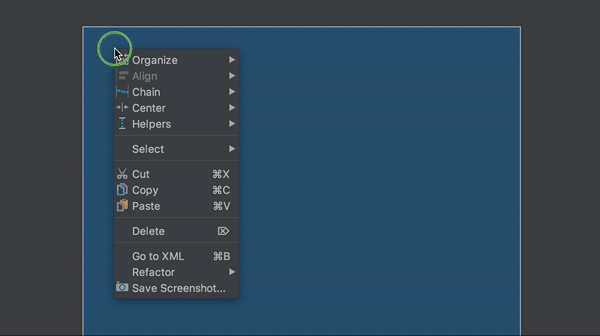
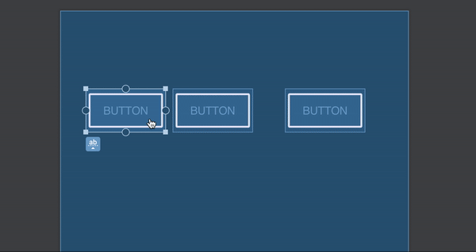
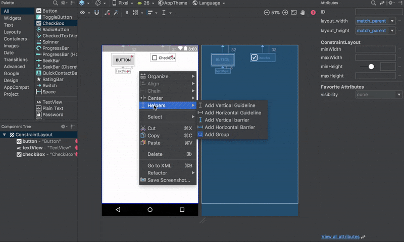
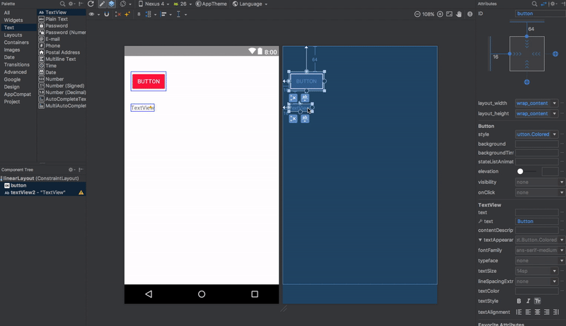

# Constrain Layout

## Properties

### Canh vị trí

```xml
<>
//RelativeLayout
android:layout_alignStart="@id/view"
android:layout_alignLeft="@id/view"
android:layout_alignEnd="@id/view"
android:layout_alignRight="@id/view"
android:layout_alignTop="@id/view"
android:layout_alignBaseline="@id/view"
android:layout_alignBottom="@id/view"

//ConstraintLayout
app:layout_constraintStart_toStartOf="@id/view"
app:layout_constraintLeft_toLeftOf="@id/view"
app:layout_constraintEnd_toEndOf="@id/view"
app:layout_constraintRight_toRightOf="@id/view"
app:layout_constraintTop_toTopOf="@id/view"
app:layout_constraintBaseline_toBaselineOf="@id/view"
app:layout_constraintBottom_toBottomOf="@id/view"
```

---

### Guidelines, Barriers, Chains and Groups

- Guidelines: Tạo 1 line, Hỗ trợ canh View, padding, phần trăm



- Chains: Quan hệ các Views




- Barriers: Nhóm nhiều Views, Hỗ trợ padding, margin nhiều Views, với View khác

```xml
<androidx.constraintlayout.widget.Barrier
    android:id="@+id/barrier"
    android:layout_width="wrap_content"
    android:layout_height="wrap_content"
    app:barrierDirection="start"
    app:constraint_referenced_ids="button1,button2" />

    <!-- barrierDirection: Vị trí Barrier -->
```



- Groups: Nhóm nhiều View (Hỗ trợ Ẩn hiện)



## Reference

- <https://kipalog.com/posts/Android--Constraint-layout---Phan-1--Thiet-ke>
- <https://riggaroo.dev/constraintlayout-guidelines-barriers-chains-groups>
