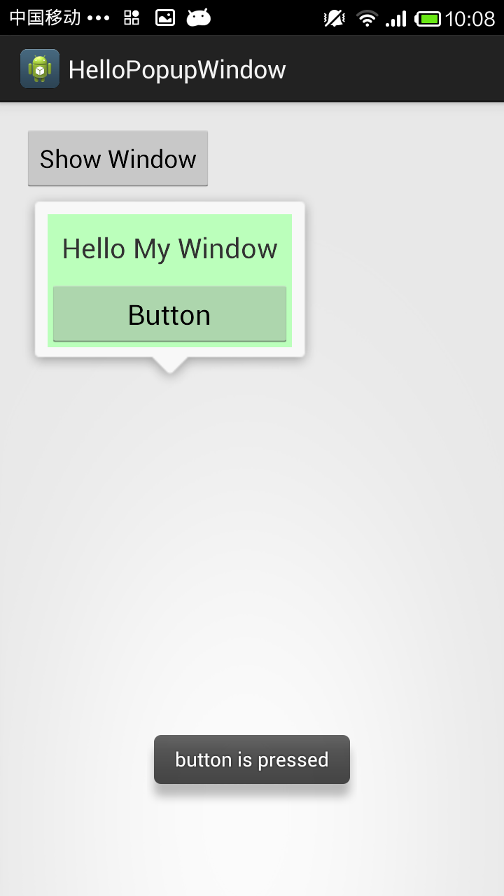

# Menu with CustomView - Popup Window



```java
 private void showPopupWindow(View view) {

    // A custom layout, as the display content
    View contentView = LayoutInflater.from(mContext).inflate(
            R.layout.pop_window, null);
    // Set the button click event
    Button button = (Button) contentView.findViewById(R.id.button1);
    button.setOnClickListener(new OnClickListener() {

        @Override
        public void onClick(View v) {
            Toast.makeText(mContext, "button is pressed",
                    Toast.LENGTH_SHORT).show();
        }
    });

    final PopupWindow popupWindow = new PopupWindow(contentView,
            ViewGroup.LayoutParams.WRAP_CONTENT, ViewGroup.LayoutParams.WRAP_CONTENT, true);

    popupWindow.setTouchable(true);

    popupWindow.setTouchInterceptor(new OnTouchListener() {

        @Override
        public boolean onTouch(View v, MotionEvent event) {

            Log.i("mengdd", "onTouch : ");

            return false;
            // It returns true if the words, the touch event will be blocked
            // PopupWindow onTouchEvent interception is not called, so click on the external area cannot be dismiss
        }
    });

    // If you do not set the PopupWindow background, both the external region click or Back keys are not dismiss box
    // I think there is a bug API
    popupWindow.setBackgroundDrawable(getResources().getDrawable(
            R.drawable.selectmenu_bg_downward));

    // After setting the parameter to show
    popupWindow.showAsDropDown(view);

}
```

---

**References:**

- <https://www.programering.com/a/MDMxETMwATE.html>
