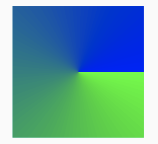
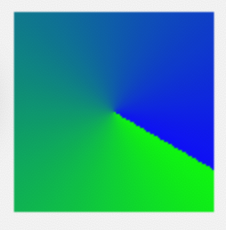

# On Draw

## Example


```java
class CircleProgressBar : View {
    // Màu bắt đầu
    private var circleStartColor: Int = Color.BLACK
    // Màu kết thúc
    private var circleEndColor: Int = Color.GRAY
    // độ rộng
    private var circleWidth: Float = 0f
    private var percent = 0

    private var circlePaint: Paint = Paint()
    private var centerX = 0f
    private var centerY = 0f


    constructor(context: Context): super(context) {
        init(context, null)
    }

    constructor(context: Context, attrs: AttributeSet?) : super(context, attrs) {
        init(context, attrs)
    }

    constructor(context: Context, attrs: AttributeSet?, defStyleAttr: Int) : super(context, attrs, defStyleAttr) {
        init(context, attrs)
    }

    @TargetApi(Build.VERSION_CODES.LOLLIPOP)
    constructor(
        context: Context,
        attrs: AttributeSet?,
        defStyleAttr: Int,
        defStyleRes: Int
    ) : super(context, attrs, defStyleAttr, defStyleRes) {
        init(context, attrs)
    }

    override fun onMeasure(widthMeasureSpec: Int, heightMeasureSpec: Int) {
        centerX = (widthMeasureSpec / 2).toFloat()
        centerY = (widthMeasureSpec / 2).toFloat()
        setMeasuredDimension(widthMeasureSpec, heightMeasureSpec)
    }

    private fun init(context: Context, attrs: AttributeSet?) {
        val typedArray = context.theme.obtainStyledAttributes(attrs, R.styleable.attrsCircleProgressBar, 0, 0)

        circleStartColor = typedArray.getColor(R.styleable.attrsCircleProgressBar_circleStartColor, Color.RED)
        circleEndColor = typedArray.getColor(R.styleable.attrsCircleProgressBar_circleEndColor, Color.BLUE)
        circleWidth = typedArray.getDimension(R.styleable.attrsCircleProgressBar_circleWidth, 4f)
        percent = typedArray.getInteger(R.styleable.attrsCircleProgressBar_percent, 0)
    }

    @SuppressLint("DrawAllocation")
    override fun onDraw(canvas: Canvas) {
        super.onDraw(canvas)
        var rect = RectF(0f, 0f, height.toFloat(), width.toFloat())

        // Viền sẽ ra ngoài, nên trừ độ rộng viền
        val halfWidth = circleWidth / 2
        val circleRectF = RectF(
            rect.left + halfWidth,
            rect.top + halfWidth,
            rect.right - halfWidth,
            rect.bottom - halfWidth)


        // toạ độ bắt đầu vẽ (270 là trên Top)
        val startRadius = 270f  
        // Độ xoay
        val rotateDegree = 360 * (percent / 100f)


        circlePaint.isDither = true // Hoà màu lại (đẹp hơn khi vẽ chuyển màu)
        circlePaint.isAntiAlias = true  // Làm mềm vùng bo (đẹp hơn khi vẽ hình tròn)
        circlePaint.style = Paint.Style.STROKE  // Vẽ stroke (viền)
        circlePaint.strokeCap = Paint.Cap.ROUND // Bo tròn đầu
        circlePaint.strokeWidth = circleWidth


        // === Chuyển màu ===
        //circlePaint.color = circleStartColor  // vẽ đơn sắt
        // các màu
        val colors = intArrayOf(circleStartColor, circleEndColor)
        val startPosition = 1 - percent.toFloat() / 100
        // Vị trí màu
        val positions = floatArrayOf(startPosition, 1f)
        val gradient = SweepGradient(circleRectF.centerX(), circleRectF.centerY(), colors, positions)

        // === Độ xoay của màu ===
        // rotate from right (0 degree, bottom = 90 degree)
        // Xác định toạ độ bắt đầu
        val gradientMatrix = Matrix()
        val gradientDegree = startRadius + rotateDegree + circleWidth // + circleWidth: because of strokeCap = Paint.Cap.ROUND
        gradientMatrix.preRotate(gradientDegree, circleRectF.centerX(), circleRectF.centerY())
        gradient.setLocalMatrix(gradientMatrix)
        circlePaint.shader = gradient


        // Vẽ hình chữ nhật
        //circlePaint.style = Paint.Style.FILL_AND_STROKE
        //canvas.drawRect(circleRectF, circlePaint)

        // Vẽ đường cong
        canvas.drawArc(circleRectF, startRadius, rotateDegree, false, circlePaint)
    }


    fun setProgress(progress: Int) {
        this.percent = progress
        invalidate()
        requestLayout()
    }

    fun setColor(startColor: Int, endColor: Int) {
        this.circleStartColor = startColor
        this.circleEndColor = endColor
        invalidate()
        requestLayout()
    }
}
```

```xml
<!-- values/attrs.xml -->
<?xml version="1.0" encoding="utf-8"?>
<resources>
    <declare-styleable name="attrsCircleProgressBar">
        <attr name="percent" format="integer" />
        <attr name="circleEndColor" format="color" />
        <attr name="circleStartColor" format="color" />
        <attr name="circleWidth" format="dimension" />
    </declare-styleable>
</resources>
```

### Cách sử dụng

```xml
<com.example.testapp.customview.CircleProgressBar
    android:layout_width="100dp"
    android:layout_height="100dp"
    android:background="#eee"
    android:layout_gravity="center"
    app:percent="60"
    app:circleWidth="10dp"
    app:circleStartColor="#03A9F4"
    app:circleEndColor="#E91E1E"/>
```

## Gradient

### Gradient Xoay Bình thường



```java
// Vẽ Gradient xoay
val colors = intArrayOf(Color.GREEN, Color.BLUE)
val positions = floatArrayOf(0f, 1f)
val gradient = SweepGradient(rect.centerX(), rect.centerY(), colors, positions)
circlePaint.shader = gradient

// Vẽ chữ nhật
circlePaint.style = Paint.Style.FILL_AND_STROKE
canvas.drawRect(circleRectF, circlePaint)
```

### Gradient xoay 30 độ



```java
// ===== Màu =====
val colors = intArrayOf(Color.GREEN, Color.BLUE)
val positions = floatArrayOf(0f, 1f)
val gradient = SweepGradient(rect.centerX(), rect.centerY(), colors, positions)
//circlePaint.shader = gradient

// ===== Xoay 30 độ =====
val gradientMatrix = Matrix()
gradientMatrix.preRotate(30f, circleRectF.centerX(), circleRectF.centerY())
gradient.setLocalMatrix(gradientMatrix)
circlePaint.shader = gradient

// Vẽ chữ nhật
circlePaint.style = Paint.Style.FILL_AND_STROKE
canvas.drawRect(circleRectF, circlePaint)
```

---

## Reference

- <https://viblo.asia/p/canvas-trong-android-phan-1-bJzKm1eDK9N>
- <https://viblo.asia/p/huong-dan-tao-vong-quay-roulette-trong-android-6J3ZgEQM5mB>
