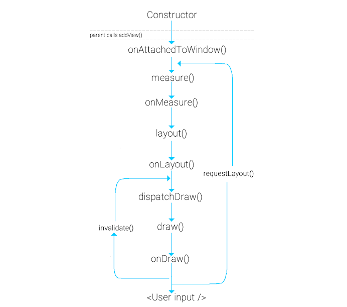
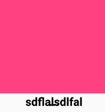

# Tạo View đặt biệt

- [Tạo View đặt biệt](#tạo-view-đặt-biệt)
  - [View Life Cycle](#view-life-cycle)
  - [Code Example](#code-example)
    - [Tạo 1 Button Với 1 Layout riêng](#tạo-1-button-với-1-layout-riêng)
      - [Tạo 1 layout: res/layout/view_custom_button.xml](#tạo-1-layout-reslayoutview_custom_buttonxml)
      - [Tạo 1 file chứa thuộc tính của View: values/atrrs_custom_button.xml](#tạo-1-file-chứa-thuộc-tính-của-view-valuesatrrs_custom_buttonxml)
      - [Tạo 1 file Khởi tạo cho Button: CustomButton.java](#tạo-1-file-khởi-tạo-cho-button-custombuttonjava)
      - [Sử dụng trong Layout](#sử-dụng-trong-layout)
      - [Sử dụng trong Component](#sử-dụng-trong-component)
    - [Tạo 1 Button Vẽ bằng Canvas](#tạo-1-button-vẽ-bằng-canvas)
      - [File: res/values/attrs_draw_button.xml](#file-resvaluesattrs_draw_buttonxml)
      - [File: DrawButton.java](#file-drawbuttonjava)
      - [Sử dụng trong Layout](#sử-dụng-trong-layout-1)
      - [Sử dụng trong Component](#sử-dụng-trong-component-1)
    - [Ghi Chú](#ghi-chú)
      - [View Update](#view-update)
      - [Find Child View](#find-child-view)
  - [Reference](#reference)

## View Life Cycle

Vòng đời 1 View



## Code Example

### Tạo 1 Button Với 1 Layout riêng



#### Tạo 1 layout: res/layout/view_custom_button.xml

```xml
<LinearLayout xmlns:android="http://schemas.android.com/apk/res/android"
    android:layout_width="match_parent"
    android:layout_height="match_parent"
    android:orientation="horizontal">

    <ImageView
        android:id="@+id/customButton_image"
        android:layout_width="wrap_content"
        android:layout_height="wrap_content"
        android:src="@android:drawable/ic_delete"
        android:scaleType="fitXY"
        android:background="#fff" />
    <TextView
        android:id="@+id/customButton_text"
        android:textColor="#000"
        android:layout_width="match_parent"
        android:layout_height="wrap_content"
        android:textSize="20sp"
        android:text=""
        android:textStyle="bold"
        android:gravity="center_horizontal" />

</LinearLayout>
```

#### Tạo 1 file chứa thuộc tính của View: values/atrrs_custom_button.xml

```xml
<resources>
    <!--Thuộc tính Custom Button-->
    <declare-styleable name="attrsCustomButton">
        <attr name="title" format="string" />
        <attr name="textPosition" format="enum">
            <enum name="left" value="1" />
            <enum name="right" value="2" />
        </attr>
    </declare-styleable>
</resources>
```

#### Tạo 1 file Khởi tạo cho Button: CustomButton.java

```java
public class CustomButton extends RelativeLayout {

    // child view
    TextView mTextView;

    public CustomButton(Context context) {
        super(context);
        init(context, null);
    }

    public CustomButton(Context context, AttributeSet attrs) {
        this(context, attrs, 0);
        init(context, attrs);
    }

    public CustomButton(Context context, AttributeSet attrs, int defStyleAttr) {
        super(context, attrs, defStyleAttr);
        init(context, attrs);
    }

    private void init(Context context, AttributeSet attrs) {
        // lấy Value qua "Text" của Android: android:text="nghia"
        //mTitle = attrs.getAttributeValue("http://schemas.android.com/apk/res/android", "text");

        // Lấy Value qua Custom Attribute
        TypedArray ta = context.getTheme().obtainStyledAttributes(attrs, R.styleable.attrsCustomButton, 0, 0);
        // Lấy thông tin trong Attr
        String title = ta.getString(R.styleable.attrsCustomButton_title);
        ta.recycle();


        // dùng Layout Inflater thêm Layout vào CustomButton
        LayoutInflater inflater = (LayoutInflater) getContext().getSystemService(Context.LAYOUT_INFLATER_SERVICE);
        if (inflater != null) {
            inflater.inflate(R.layout.view_custom_button, this);

            // find Views
            this.mTextView = (TextView) findViewById(R.id.customButton_text);

            //thiết lập cho TextView trên CustomButton hiện tại
            this.mTextView.setText(title);
        }
    }

    @Override
    protected void onMeasure(int widthMeasureSpec, int heightMeasureSpec) {
        // Wrap_Content
        int height = 0;
        int width = 0;
        for(int i = 0; i < getChildCount(); i++) {
            View child = getChildAt(i);
            child.measure(widthMeasureSpec, MeasureSpec.makeMeasureSpec(0, MeasureSpec.UNSPECIFIED));

            int h = child.getMeasuredHeight();
            int w = child.getMeasuredWidth();

            if(h > height) height = h;
            if(w > width) width = w;
        }

        if (height != 0) {
            heightMeasureSpec = MeasureSpec.makeMeasureSpec(height, MeasureSpec.EXACTLY);
        }
        if (width != 0) {
            widthMeasureSpec = MeasureSpec.makeMeasureSpec(width, MeasureSpec.EXACTLY);
        }

        super.onMeasure(widthMeasureSpec, heightMeasureSpec);
    }

    public String getTitle() {
        return mTextView.getText().toString();
    }

    public void setTitle(String title) {
        this.mTextView.setText(title);
    }
}
```

#### Sử dụng trong Layout

```xml
<com.adquestasia.nghia.customview.CustomButton
    android:id="@+id/customButton"
    android:layout_width="match_parent"
    android:layout_height="92dp"
    android:text="nghia"
    app:title="abcdfa" />
```

#### Sử dụng trong Component

```java
mCustomButton = (CustomButton) findViewById(R.id.customButton);
mCustomButton.setTitle("sdflalsdlfal");
```

### Tạo 1 Button Vẽ bằng Canvas


#### File: res/values/attrs_draw_button.xml

```xml
<resources>
    <declare-styleable name="attrsDrawButton">
        <attr name="circleColor" format="color" />
        <attr name="circleLabel" format="string"></attr>
        <attr name="labelColor" format="color"></attr>
    </declare-styleable>
</resources>
```

#### File: DrawButton.java

```java
/**
 * Custom view Tạo giao diện bằng = Draw api (Code)
 * http://code.tutsplus.com/tutorials/android-sdk-creating-custom-views--mobile-14548
 */
public class DrawButton extends View {

    //circle and text colors
    private int circleCol, labelCol;
    //label text
    private String circleText;
    //paint for drawing custom view
    private Paint circlePaint;

    public DrawButton(Context context) {
        super(context);
        initPaints(context, null);
    }

    public DrawButton(Context context, AttributeSet attrs) {
        super(context, attrs);
        initPaints(context, attrs);
    }

    private void initPaints(Context context, AttributeSet attrs) {
        //paint object for drawing in onDraw
        circlePaint = new Paint();

        //Gọi file XML, sét giá trị các thuộc tính
        TypedArray a = getContext().getTheme().obtainStyledAttributes(attrs, R.styleable.attrsDrawButton, 0, 0);
        try {
            //get the text and colors specified using the names in attrs.xml
            circleText = a.getString(R.styleable.attrsDrawButton_circleLabel);
            circleCol = a.getInteger(R.styleable.attrsDrawButton_circleColor, 0);//0 is default
            labelCol = a.getInteger(R.styleable.attrsDrawButton_labelColor, 0);
        } finally {
            a.recycle();
        }
    }

    @Override
    protected void onMeasure(int widthMeasureSpec, int heightMeasureSpec) {
        //---Set Dimension of View---

        int w = MeasureSpec.getSize(widthMeasureSpec);
        int h = MeasureSpec.getSize(heightMeasureSpec);

        int size = Math.min(w, h);
        setMeasuredDimension(size, size);
    }

    @Override
    protected void onDraw(Canvas canvas) {
        super.onDraw(canvas);
        // --- Draw View ---

        //get half of the width and height as we are working with a circle
        int viewWidthHalf = this.getMeasuredWidth()/2;
        int viewHeightHalf = this.getMeasuredHeight()/2;

        //get the radius as half of the width or height, whichever is smaller
        //subtract ten so that it has some space around it
        int radius = 0;
        if(viewWidthHalf>viewHeightHalf)
            radius=viewHeightHalf-10;
        else
            radius=viewWidthHalf-10;

        circlePaint.setStyle(Paint.Style.FILL);
        circlePaint.setAntiAlias(true);
        //set the paint color using the circle color specified
          circlePaint.setColor(circleCol);

        canvas.drawCircle(viewWidthHalf, viewHeightHalf, radius, circlePaint);

        //set the text color using the color specified
        circlePaint.setColor(labelCol);
        //set text properties
        circlePaint.setTextAlign(Paint.Align.CENTER);
        circlePaint.setTextSize(50);

        //draw the text using the string attribute and chosen properties
        canvas.drawText(circleText, viewWidthHalf, viewHeightHalf, circlePaint);
    }

    public int getCircleColor(){
        return circleCol;
    }

    public int getLabelColor(){
        return labelCol;
    }

    public String getLabelText(){
        return circleText;
    }

    public void setCircleColor(int newColor){
        //update the instance variable
        circleCol=newColor;
        //redraw the view
        invalidate();
        requestLayout();
    }
    public void setLabelColor(int newColor){
        //update the instance variable
        labelCol=newColor;
        //redraw the view
        invalidate();
        requestLayout();
    }

    public void setLabelText(String newLabel){
        //update the instance variable
        circleText=newLabel;
        //redraw the view
        invalidate();
        requestLayout();
    }
}
```

#### Sử dụng trong Layout

```xml
<com.adquestasia.nghia.customview.DrawButton
    android:id="@+id/drawButton"
    android:layout_width="match_parent"
    android:layout_height="100px"
    android:layout_margin="5dp"
    app:circleColor="#ff0099"
    app:circleLabel="Hello"
    app:labelColor="#ffff66" />
```

#### Sử dụng trong Component

```java
// custom button vẽ = draw
mDrawButton = (DrawButton) findViewById(R.id.drawButton);
mDrawButton.setLabelText("nghĩaddd");
```

### Ghi Chú

#### View Update

- **invalidate()** sử dụng được vẽ lại các view đơn giản. Ví dụ khi bạn u**pdate lại text, color hay tương tác chạm điểm**. Có nghĩa là view chỉ cần đơn giản gọi onDraw() để update lại trạng thái của view.
- **requestLayout()** như bạn thấy trong sơ đồ lifecycle thì method này sẽ gọi lại view update từ onMeasure(). Điều đó có nghĩa là việc thực hiện vẽ lại view sẽ được **tính toán lại kích thướ**c. Kích thước mới có thể được tính lại ở onMeasure vẽ sẽ thực hiện vẽ theo kích thước mới đó.

#### Find Child View

```xml
<declare-styleable name="CustomContainer">
    <attr name="empty_id" format="reference|enum" />
</declare-styleable>
```

```xml
<self.tranluunghia.testandroid.MultipleStateV2View
    app:empty_id="@id/viewEmpty">

    <TextView android:id="@+id/viewEmpty" />

</self.tranluunghia.testandroid.MultipleStateV2View
```

```java
class CustomContainer : FrameLayout {
    private var emptyId: Int = LAYOUT_EMPTY
    var emptyView: View? = null

    private fun init(context: Context, attrs: AttributeSet?) {
            val typedArray = context.theme.obtainStyledAttributes(attrs, R.styleable.CustomContainer, 0, 0)
            emptyId = typedArray.getResourceId(R.styleable.CustomContainer_empty_id, LAYOUT_EMPTY)
    }

    override fun onFinishInflate() {
        super.onFinishInflate()

        // ===== FIND IN HERE ======
        if (emptyId != LAYOUT_EMPTY)
            emptyView = findViewById<View>(emptyId)
    }
}
```

---

## Reference

- <https://viblo.asia/p/android-custom-view-924lJr6zlPM>
